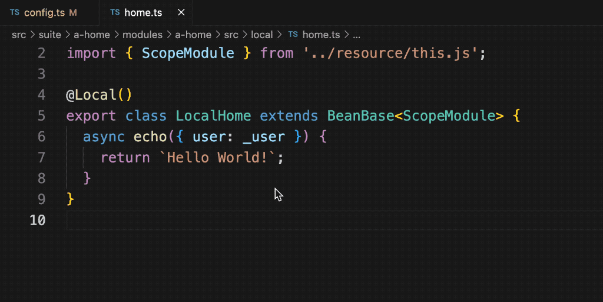

# 比nestjs更优雅的ioc: 基础篇

## 使用ts的最佳境界: 化类型于无形

什么是`化类型于无形`？简而言之，就是无须标注类型，却能享受到`类型约束`和`智能提示`的好处

我们都知道，在项目中使用 ts 可以带来类型智能提示与校验的诸多好处。同时，为了减少类型标注，达到`化类型于无形`的效果，Cabloy-Pro5 引入了 ioc 和依赖查找的机制，从而让我们的代码保持优雅和简洁，进而显著提升开发效率，保证代码质量

## ioc的两种策略

基于 TS 的后端框架一般都会提供依赖容器，实现控制反转。控制反转有两种策略：**依赖注入**和**依赖查找**。Cabloy-Pro5 同时支持**依赖注入**和**依赖查找**，并且让**依赖查找**的代码更加简洁高效，下面挑几个特性举例说明:

1. Service 服务
2. Config 配置
3. 多语言
4. 错误异常

## 一、Service服务

### 1\. 创建一个Service

在 Cabloy-Pro5 中，local bean 相当于 nestjs 中 service 的概念，下面创建一个 local bean

```javascript
@Local()
export class LocalHome {
  async echo() {
    return `Hello World!`;
  }
}
```

1. 通过`@Local`声明 LocalHome 是一个 local bean

### 2\. Service的依赖注入

接下来，在 Controller 中采用依赖注入的方式来使用 LocalHome

```javascript
import { LocalHome } from '../local/home.js';

@Controller()
export class ControllerHome {
  @Use()
  home: LocalHome;

  async echo() {
    const res = await this.home.echo({
      user: this.ctx.state.user.op,
    });
    this.ctx.success(res);
  }
}
```

1. 使用`@Use`注入 LocalHome

### 3\. Service的依赖查找

然后，在 Controller 中采用依赖查找的方式来使用 LocalHome

```javascript
export class ControllerHome {
  async echo() {
    const res = await this.scope.local.home.echo({
      user: this.ctx.state.user.op,
    });
    this.ctx.success(res);
  }
}
```

1. 不需要导入 LocalHome，直接在代码中使用`this.scope.local`来访问容器中的 local bean 实例

看一下动画演示，提供了完整的类型智能提示：


## 二、Config配置

### 1. 定义Config

可以为业务模块单独定义一些 Config 配置，如下：

```diff
export const config = (_app: CabloyApplication) => {
  return {
+   prompt: 'hello world',
  };
};
```

### 2. 使用Config

可以在 LocalHome 中直接使用刚才定义的 config

```diff
export class LocalHome {
  async echo() {
+   return this.scope.config.prompt;
-   return `Hello World!`;
  }
}
```

1. 不需要导入任何类型，直接在代码中使用`this.scope.config`来访问当前业务模块中的 config 配置

看一下动画演示，提供了完整的类型智能提示：



## 三、多语言

### 1. 定义语言资源

可以为业务模块定义语言资源，比如，这里分别定义英文和中文两种语言资源

`英文`

```javascript
export default {
  HelloWorld: 'Hello World',
};
```

`中文`

```javascript
export default {
  HelloWorld: '您好世界',
};
```

### 2. 使用语言资源

可以在 LocalHome 中直接使用刚才定义的语言资源

```diff
export class LocalHome {
  async action() {
+   // 自动判断当前语言
+   const message = this.scope.locale.HelloWorld();
+   // 强制使用英文资源
+   const message1 = this.scope.locale.HelloWorld.locale('en-us');
+   // 强制使用中文资源
+   const message2 = this.scope.locale.HelloWorld.locale('zh-cn');
+   return `${message}:${message1}:${message2}`;
-   return this.scope.config.prompt;
  }
}
```

1. 不需要导入任何类型，直接在代码中使用`this.scope.locale`来访问当前业务模块中的语言资源

看一下动画演示，提供了完整的类型智能提示：


## 四、错误异常

### 1. 定义错误码

可以为业务模块定义错误码

```diff
export enum Errors {
+ Error001 = 1001,
}
```

1. 这里定义了一个错误枚举类型 Error001，对应的错误码是 1001

### 2. 定义错误码对应的语言资源

可以为错误码定义语言资源，比如，这里分别定义英文和中文两种语言资源

`英文`

```diff
export default {
+ Error001: 'This is a test',
  HelloWorld: 'Hello World',
};
```

`中文`

```diff
export default {
+ Error001: '这是一个错误',
  HelloWorld: 'Hello World',
};
```

### 3. 抛出错误异常

可以在 LocalHome 中直接使用刚才定义的错误枚举值，并抛出异常

```diff
export class LocalHome {
  async action() {
+   // 直接抛出异常
+   this.scope.error.Error001.throw();
-   return this.scope.config.prompt;
  }
}
```

1. 不需要导入任何类型，直接在代码中使用`this.scope.error`来访问当前业务模块中的错误枚举值

看一下动画演示，提供了完整的类型智能提示：


## 后记

Cabloy-Pro4 中就已经提供了大量业务能力，比如：工作流引擎、表单引擎、权限引擎、字段权限、多级缓存、模块化体系、分布式架构、多租户引擎，等等。随着 Cabloy-Pro5 Typescript 的赋能，这些业务能力也随之有了全新的表现
