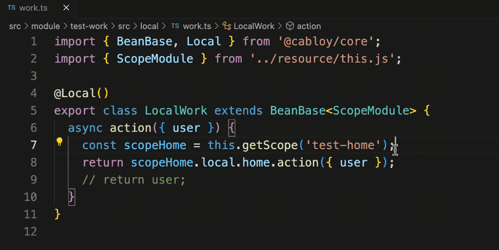
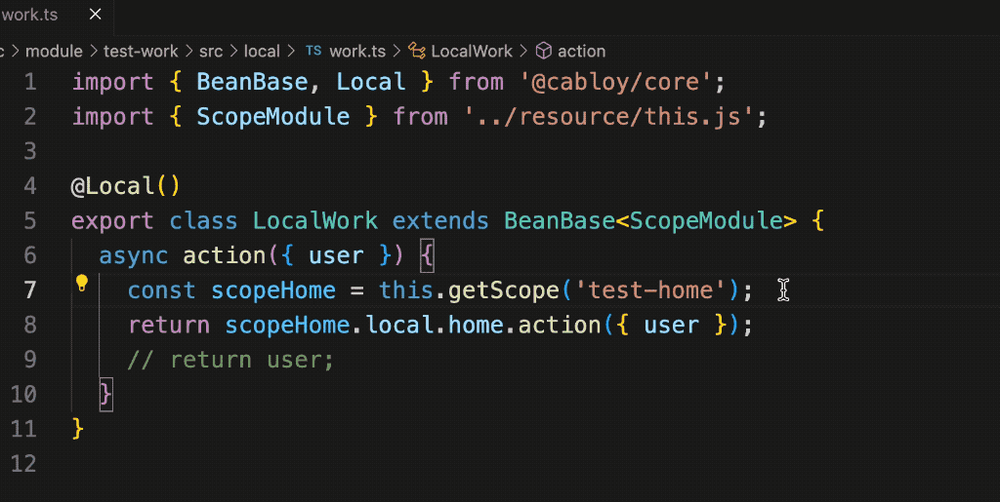
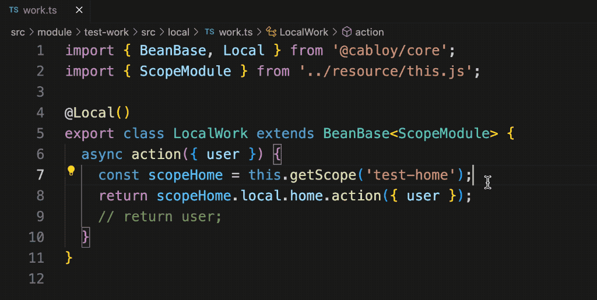

# 比nestjs更优雅的ioc: 跨模块访问资源

## 使用ts的最佳境界: 化类型于无形

在项目中使用 ts 可以带来类型智能提示与校验的诸多好处。同时，为了减少类型标注，达到`化类型于无形`的效果，Cabloy-Pro5 引入了 ioc 和依赖查找的机制。在上一篇文章中，我们创建了一个业务模块 test-home，并且采用依赖查找的机制演示了如何优雅的定义和使用资源，包括：Service 服务、Config 配置、国际化语言资源、Error 错误异常

在实际的项目当中，经常会遇到跨模块访问资源的场景，那么 Cabloy-Pro5 的依赖查找机制是否仍然可以优雅的实现跨模块访问呢？让我们一睹为快

## 模块化体系与任务说明

Cabloy-Pro5 全栈框架的前后端均采用模块化体系。一个 Cabloy-Pro5 项目由多个业务模块组成，每个业务模块都可以包含与自身业务相关的资源，比如：Service 服务、Config 配置、国际化语言资源、Error 错误异常、中间件、定时任务、消息队列、系统启动项，等等

在这里，我们创建一个新的业务模块 test-work，在 test-work 中访问 test-home 提供的资源

## 1. 新建业务模块

```bash
cabloy api:create:module test-work
```

## 2. 新建API

通过一个命令同时创建一组文件

```bash
cabloy api:create:controller work
```

- Route: `src/module/test-work/src/routes.ts`
- Controller: `src/module/test-work/src/controller/work.ts`
- Service: `src/module/test-work/src/local/work.ts`

## 3. 跨模块访问Service服务

接下来，我们在刚才新建的 Service 当中，访问模块 test-home 的 Service 服务

```diff
import { BeanBase, Local } from '@cabloy/core';
import { ScopeModule } from '../resource/this.js';

@Local()
export class LocalWork extends BeanBase<ScopeModule> {
  async action({ user }) {
+   const scopeHome = this.getScope('test-home');
+   return scopeHome.local.home.action({ user });
    // return user;
  }
}
```

1. 通过 getScope 方法获取模块 test-home 的 scope 对象
2. 通过 scope 对象直接访问 Service 服务: `home`

看一下动画演示，提供了完整的类型智能提示：


## 4. 跨模块访问Config配置

访问模块 test-home 的 Config 配置

```diff
import { BeanBase, Local } from '@cabloy/core';
import { ScopeModule } from '../resource/this.js';

@Local()
export class LocalWork extends BeanBase<ScopeModule> {
  async action({ user }) {
    const scopeHome = this.getScope('test-home');
+   const prompt = scopeHome.config.prompt;
    return scopeHome.local.home.action({ user });
    // return user;
  }
}
```

1. 直接通过 scopeHome 取得 config 中的 prompt 属性值

看一下动画演示，提供了完整的类型智能提示：



## 5. 跨模块访问国际化语言资源

访问模块 test-home 的国际化语言资源

```diff
import { BeanBase, Local } from '@cabloy/core';
import { ScopeModule } from '../resource/this.js';

@Local()
export class LocalWork extends BeanBase<ScopeModule> {
  async action({ user }) {
    const scopeHome = this.getScope('test-home');
+   const message = scopeHome.locale.HelloWorld();
+   const message1 = scopeHome.locale.HelloWorld.locale('en-us');
+   const message2 = scopeHome.locale.HelloWorld.locale('zh-cn');
    return scopeHome.local.home.action({ user });
    // return user;
  }
}
```

看一下动画演示，提供了完整的类型智能提示：



## 6. 跨模块访问Error错误异常

抛出模块 test-home 提供的 Error 错误异常

```diff
import { BeanBase, Local } from '@cabloy/core';
import { ScopeModule } from '../resource/this.js';

@Local()
export class LocalWork extends BeanBase<ScopeModule> {
  async action({ user }) {
    const scopeHome = this.getScope('test-home');
+   scopeHome.error.Error001.throw();
    return scopeHome.local.home.action({ user });
    // return user;
  }
}
```

1. 直接通过 scopeHome 抛出错误异常 Error001

看一下动画演示，提供了完整的类型智能提示：



## 后记

CabloyJS 采用 ioc 和依赖查找的机制，让 ts 的使用达到了`化类型于无形`的最佳境界，从而让我们的代码保持优雅和简洁，进而也能显著提升开发效率，保证代码质量
