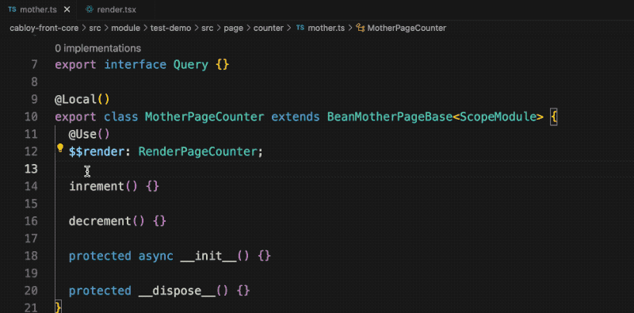

# @cabloy/front-element

@cabloy/front-element is a vue3 framework with ioc container. With the support of ioc container, defining reactive states no longer needs `ref/reactive`, nor `ref.value`

[![LICENSE MIT][license-image]][license-url]
[![NPM version][npm-image]][npm-url]
[![NPM download][download-image]][download-url]

[license-image]: https://img.shields.io/badge/license-MIT-blue.svg
[license-url]: https://github.com/cabloy/cabloy-front/blob/master/LICENSE
[npm-image]: https://img.shields.io/npm/v/@cabloy/front-element.svg?style=flat-square
[npm-url]: https://npmjs.com/package/@cabloy/front-element
[download-image]: https://img.shields.io/npm/dm/@cabloy/front-element?color=orange&label=npm%20downloads
[download-url]: https://npmjs.com/package/@cabloy/front-element

## Documentation

- [Get Started](https://front.cabloy.com/guide/start/introduction.html)
- [Why Vue3+IOC?](https://front.cabloy.com/guide/start/why.html)

## Features

@cabloy/front-element has introduced the following distinct features for Vue3:

1. `No ref/reactive`: Class instances support reactive by default, so the state in the instance does not need to be declared reactive through `ref/reactive`. Additionally, usage of `raw data` and `partially reactive` is still supported
2. `No ref.value`: Without ref, naturally there is no need to write a lot of ref.value
3. `No pinia`: Global state objects can be created directly based on the global IOC container

## Gif demonstration



## Demonstration: no `ref/reactive`, no `ref.value`

### 1. Define reactive state

Define a reactive variable `count` in the component and add two methods to modify its value

```typescript
export class MotherPageCounter {
  count: number = 0;

  inrement() {
    this.count++;
  }

  decrement() {
    this.count--;
  }
}
```

### 2. Use reactive state

Use `count` in render class

```typescript
export class RenderPageCounter {
  render() {
    return (
      <div>
        <div>count(ref): {this.count}</div>
        <button onClick={() => this.inrement()}>Inrement</button>
        <button onClick={() => this.decrement()}>Decrement</button>
      </div>
    );
  }
}
```

## Demonstration: dependency injection

### 1. Logic Reuse

Create a `Counter` Bean to implement the logic of `count`

```typescript
@Local()
export class Counter {
  count: number = 0;

  inrement() {
    this.count++;
  }

  decrement() {
    this.count--;
  }
}
```

### 2. Inject and use in a component

```typescript
export class MotherPageCounter {
  @Use()
  $$counter: Counter;
}
```

```typescript
export class RenderPageCounter {
  render() {
    return (
      <div>
        <div>count(ref): {this.$$counter.count}</div>
        <button onClick={() => this.$$counter.inrement()}>Inrement</button>
        <button onClick={() => this.$$counter.decrement()}>Decrement</button>
      </div>
    );
  }
}
```

## Stay In Touch

- [Twitter](https://twitter.com/zhennann2024)
- [Wechat](./cabloy-docs/zh/assets/img/wx-zhennann.jpg)

## License

[MIT](./LICENSE)

Copyright (c) 2016-present, zhennann
