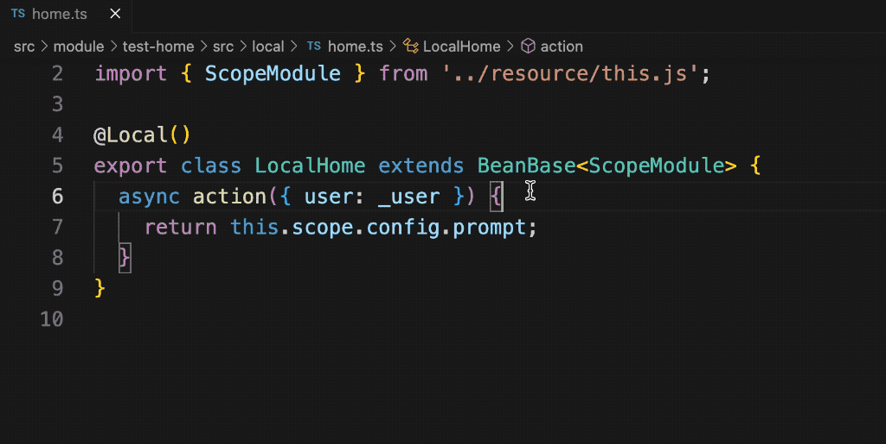

# A more elegant ioc than nestjs: Basics

## The best practice of ts: make types invisible

What is `make types invisible`? In short, you don’t need type annotations, but you can enjoy the benefits of type constraints and autocompletion

Using ts in a project can bring many benefits of intelligent type prompts and type checks. At the same time, in order to reduce type annotations and achieve the effect of `making types invisible`, Cabloy-Pro5 introduces the `ioc` and `dependency lookup` mechanisms

## Two strategies for ioc

TS-based backend frameworks typically provide dependency containers to achieve inversion of control. There are two strategies for inversion of control: dependency injection and dependency lookup. Cabloy-Pro5 supports both of them, and makes the code for dependency lookup more concise and efficient. Here are a few examples of features:

1. Service
2. Config configuration
3. I18n
4. Error exception

## I. Service

### 1. Create a Service

In Cabloy-Pro5, local bean is equivalent to the concept of service in NestJS. Here is an example of creating a local bean

```javascript
@Local()
export class LocalHome {
  async echo() {
    return `Hello World!`;
  }
}
```

1. LocalHome is declared as a local bean with `@Local`

### 2. Dependency injection for Service

Next, in the Controller, use dependency injection to use LocalHome

```javascript
import { LocalHome } from '../local/home.js';

@Controller()
export class ControllerHome {
  @Use()
  home: LocalHome;

  async echo() {
    const res = await this.home.echo({
      user: this.ctx.state.user.op,
    });
    this.ctx.success(res);
  }
}
```

1. Inject LocalHome using `@Use`

### 3. Dependency lookup for Service

Then, in the Controller, use the dependency lookup method to use LocalHome

```javascript
export class ControllerHome {
  async echo() {
    const res = await this.scope.local.home.echo({
      user: this.ctx.state.user.op,
    });
    this.ctx.success(res);
  }
}
```

1. You don't need to import LocalHome, just use `this.scope.local` in the code to access the local bean instance in the container

Take a look at the animation demo, which provides complete type intelligent prompts:


## II. Config

### 1. Define Config

You can define some Config configurations for the business module separately, as follows:

```diff
import { CabloyApplication } from '@cabloy/core';

export const config = (_app: CabloyApplication) => {
  return {
+   prompt: 'hello world',
  };
};
```

### 2. Using Config

You can directly use the configuration just defined in LocalHome

```diff
export class LocalHome {
  async echo() {
+   return this.scope.config.prompt;
-   return `Hello World!`;
  }
}
```

1. No need to import any type. Simply use `this.scope.config` in the code to access the config configuration in the current business module

Take a look at the animation demo, which provides complete type intelligent prompts:


## III、I18n

### 1. Define language resources

You can define language resources for business modules, such as defining English and Chinese language resources here

`English`

```javascript
export default {
  HelloWorld: 'Hello World',
};
```

`Chinese`

```javascript
export default {
  HelloWorld: '您好世界',
};
```

### 2. Using language resources

You can directly use the language resource just defined in LocalHome

```diff
export class LocalHome {
  async action() {
+   // automatically determine the current language
+   const message = this.scope.locale.HelloWorld();
+   // force the use of English resources
+   const message1 = this.scope.locale.HelloWorld.locale('en-us');
+   // force the use of Chinese resources
+   const message2 = this.scope.locale.HelloWorld.locale('zh-cn');
+   return `${message}:${message1}:${message2}`;
-   return this.scope.config.prompt;
  }
}
```

1. No need to import any type. Simply use `this.scope.locale` in the code to access the language resources in the current business module

Take a look at the animation demo, which provides complete type intelligent prompts:



## IV. Error exception

### 1. Define error code

You can define error codes for business modules

```diff
export enum Errors {
+ Error001 = 1001,
}
```

1. Here we define an error enumeration type Error001, with the corresponding error code being 1001

### 2. Define the language resources corresponding to the error code

You can define language resources for error codes, for example, defining English and Chinese language resources here

`English`

```diff
export default {
+ Error001: 'This is a test',
  HelloWorld: 'Hello World',
};
```

`Chinese`

```diff
export default {
+ Error001: '这是一个错误',
  HelloWorld: 'Hello World',
};
```

### 3. Throwing error exception

You can directly use the error enumeration value just defined in LocalHome and throw an exception

```diff
export class LocalHome {
  async action() {
+   // directly throw an exception
+   this.scope.error.Error001.throw();
-   return this.scope.config.prompt;
  }
}
```

1. No need to import any type. Simply use `this.scope.error` in the code to access the error enumeration values in the current business module

Take a look at the animation demo, which provides complete type intelligent prompts:


## Postscript

Cabloy-Pro4 already provides a large number of business capabilities, such as workflow engine, form engine, permission engine, field permission, multi-level cache, modular system, distributed architecture, multi-tenant engine, etc. With the empowerment of Cabloy-Pro5 Typescript, these business capabilities will also have a new expression
